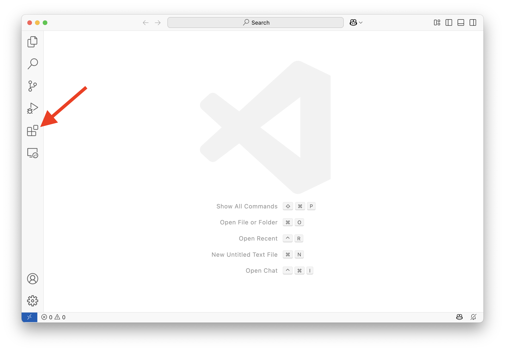
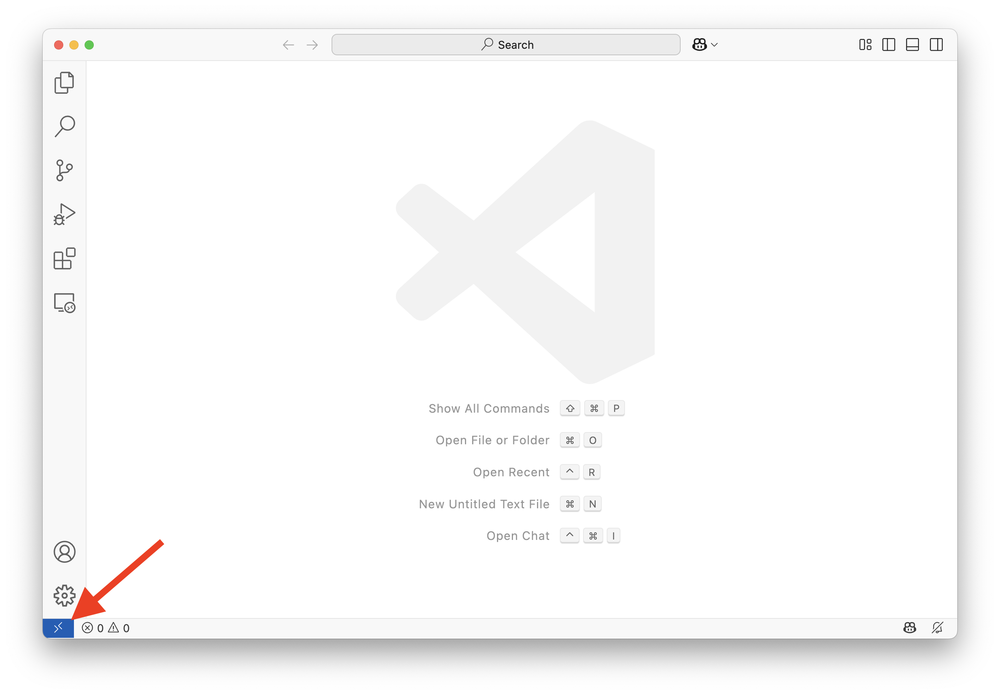
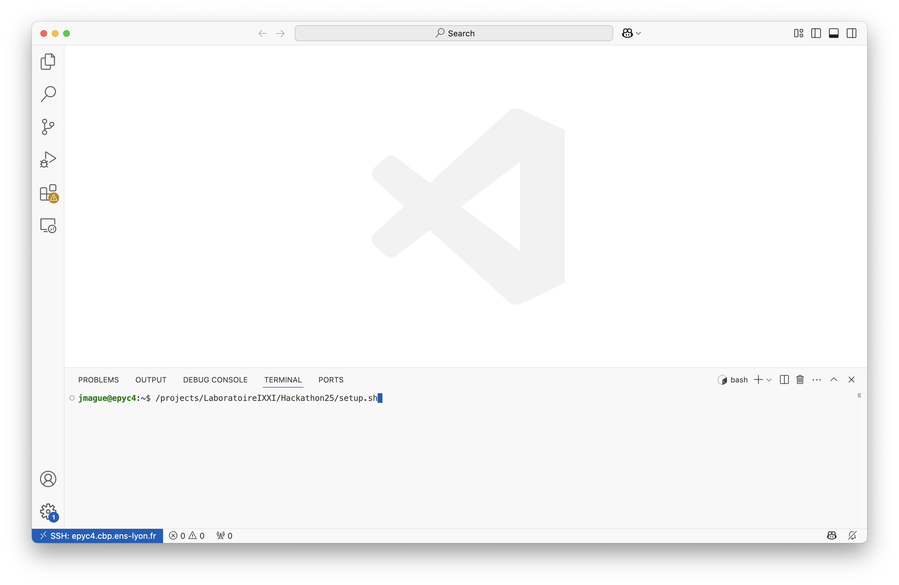
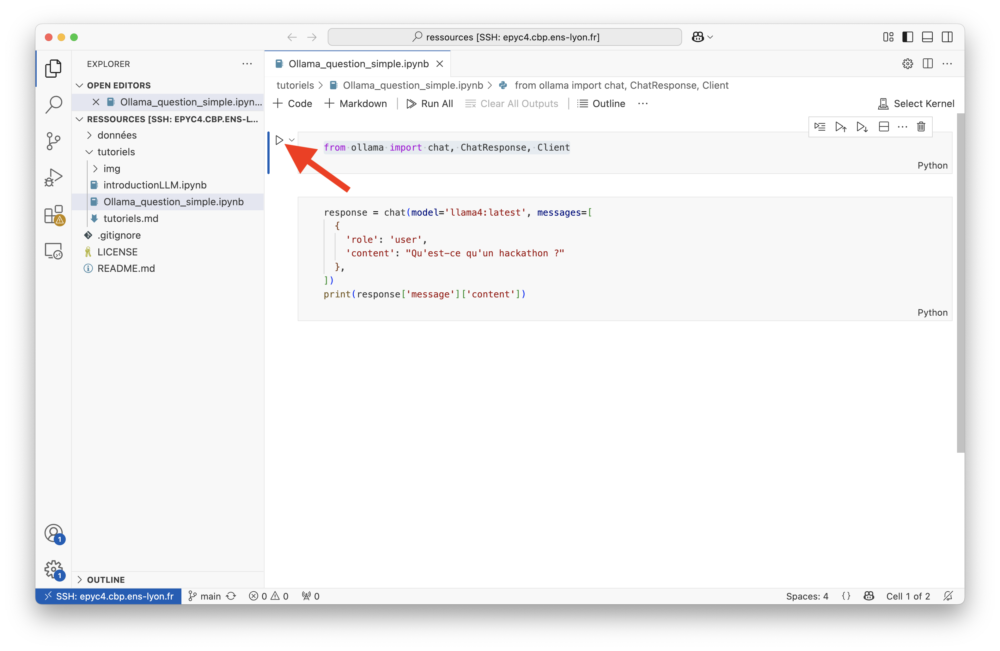

# Hackathon IXXI - Tutoriels

Pour ce hackathon, nous utiliserons des ressources proposées par le [Centre Blaise Pascal de Simulation et de Modélisation Numérique (CBPsmn)](https://www.cbp.ens-lyon.fr) :
- Les Grands Modèles de Langage que nous utiliserons sont hébérgés sur les serveurs du CBPsmn
- Le code que nous écrirons sera hébergé et exécuté sur les serveurs du CBPsmn

La première partie de ces tutoriels vous indiquera comment configurer votre environnement de travail. 

La seconde vous montrera comment interroger les modèles disponibles


## Environnement de travail
Pour coder, nous proposons d'utiliser l'éditeur [VSCode](https://code.visualstudio.com/) : il présente l'avantage de permettre de d'écrire du code sur son propre ordinateur tout en l'hébergeant et l'exécutant de manière transparente sur un serveur distant (ici, un serveur du CBPsmn).

La première étape est donc de vous assurer que VSCode est bien installé sur votre ordinateur. 

La seconde étape est d'installer l'extension *Remote – SSH* qui permettra à VSCode de se connecter à un serveur distant. Si vous lisez ceci sur votre propre ordinateur et que VSCode est installé sur celui-ci, vous pouvez installer l'extension *Remote – SSH*  en cliquant [ici](https://marketplace.visualstudio.com/items?itemName=ms-vscode-remote.remote-ssh). Sinon, vous pouvez cliquer sur l'icone *Extensions* dans la barre de gauche de VSCode :




La troisème étape consiste à indiquer a VSCode le nom du serveur sur lequel vous souhaitez vous connecter. Pour cela, cliquez sur le bouton en bas à gauche de la fenêtre de VSCode : 




Dans le menu qui s'ouvre cliquez sur *Connect to Host...* puis sur *+ Add New SSH Host*. Entrez alors la commande suivante 
* `ssg[USER]@epyc4.cbp.ens-lyon.fr`,
où [USER] est remplacé par l'identifiant de votre compte ENS. 

Vous pouvez alors cliquer de nouveau sur le bouton en bas à gauche de la fenêtre VSCode et voir, cette fois-ci, le serveur `epyc4.cbp.ens-lyon.fr`apparaitra dans le menu. Sélectionnez-le, votre mot de passe vous sera demandé. Une nouvelle fenêtre VSCode s'ouvre, vous êtes connecté au serveur. 

La dernière étape pour mettre en place votre environnement nécessite de taper une ligne de commande sur le serveur, via le terminal. Dans la fenêtre VSCode qui vient de s'ouvrir, sélectionnez dans le menu `Terminal > Nouveau terminal`. Vous pouvez alors taper la commande suivante :

```Bash
/projects/LaboratoireIXXI/Hackathon25/setup.sh
```



Votre environnement de travail sur l'infrastructure du CBPsmn est alors initialisé. Cette opération prend plusieurs minutes, le temps de :
- créer votre dossier personnel : `/projects/LaboratoireIXXI/Hackathon25/users/[USER]`
- installer un environnement python qui comprend tous les packages dont vous aurez besoin (dans `/projects/LaboratoireIXXI/Hackathon25/users/[USER]/python`)
- cloner le dépôt Github du hackaton dans `/projects/LaboratoireIXXI/Hackathon25/users/[USER]/ressources`. Vous y trouverez notamment les données, leur description et les tutoriels. 

Pour tester votre installation, vous pouvez essayer d'exécuter l'un des tutoriel. Dans VSCode, allez dans le menu `Fichier > ouvrir un dossier`. Choisissez le dossier `/projects/LaboratoireIXXI/Hackathon25/users/[USER]/ressources`. Dans le panneau de gauche, sélectionnez le fichier `tutoriels>Ollama_question_simple.ipynb` et cliquez sur le triangle pour exécuter la première cellule :



VSCode va vous demander quel kernel (quel Python) utiliser pour exécuter ce notebook. Sélectionnez `Environnement Jupyter` puis `Hackathon_IXXI`. La première cellule du notebook s'exécute. Vous pouvez à présent exécuter la seconde, qui fait appel à un LLM pour répondre à la question *Qu'est-ce qu'un hackathon ?*.

